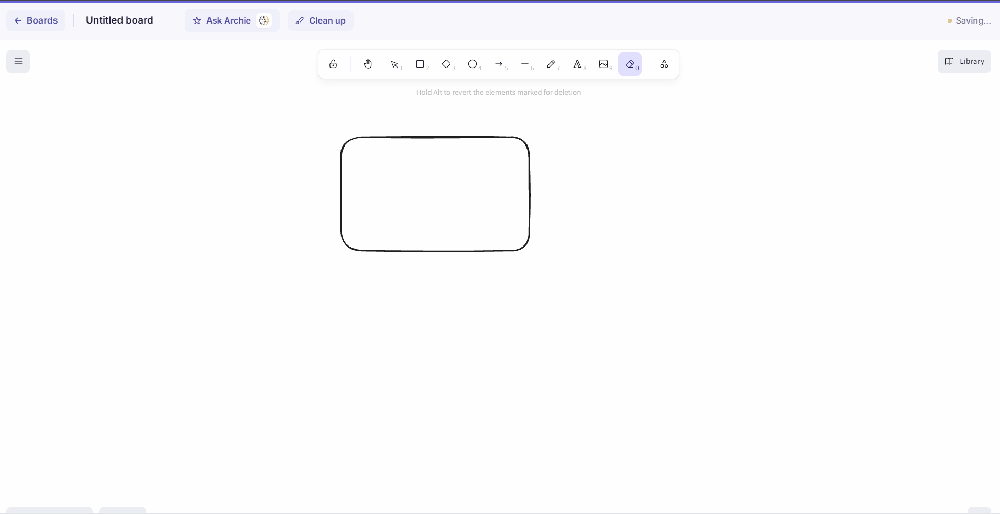
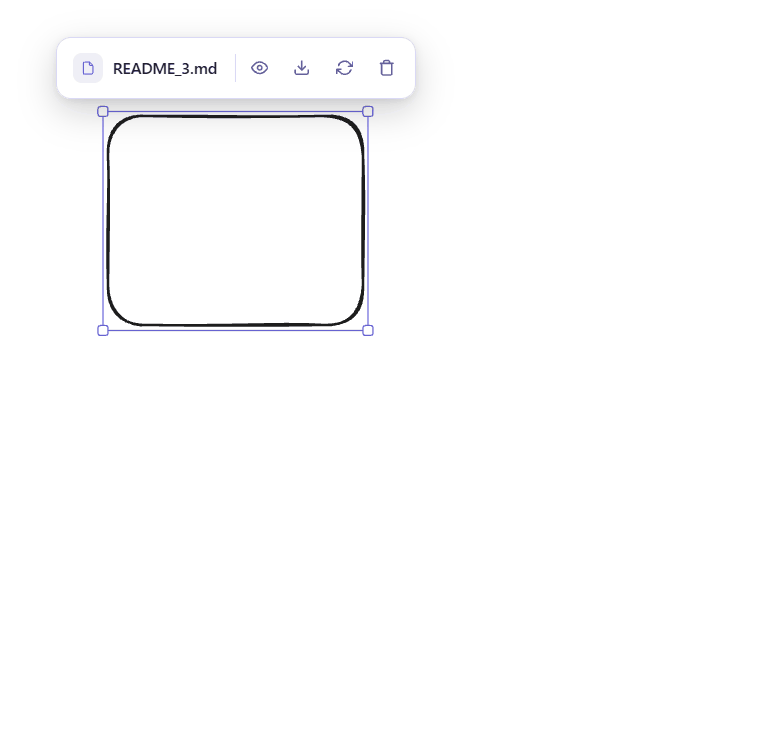
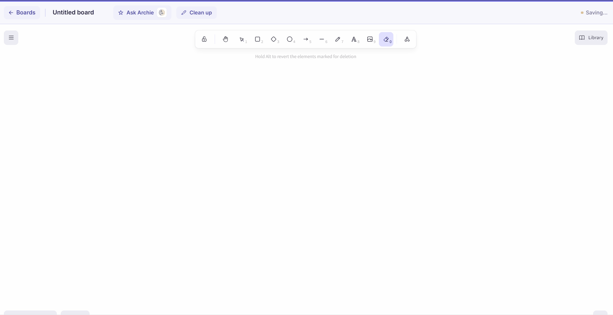
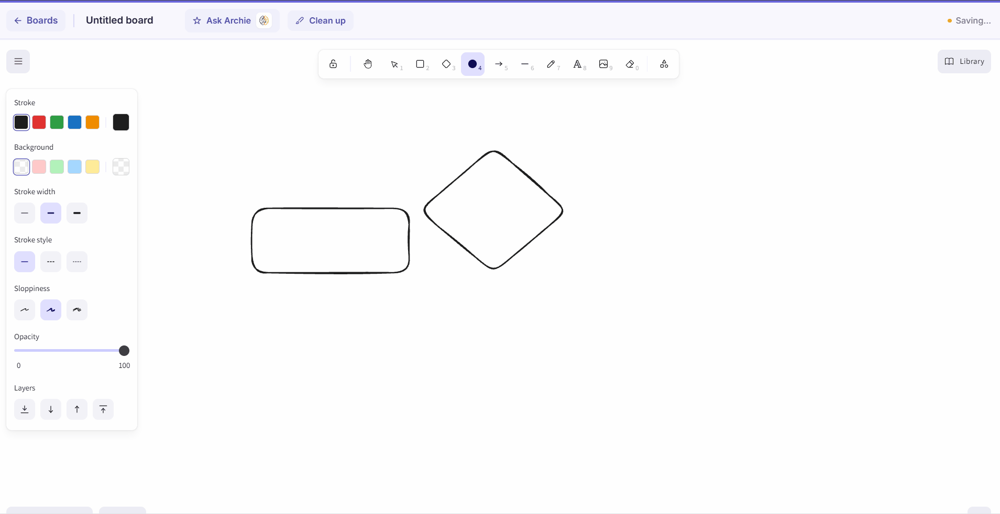

# Accelerated Excalidraw

## Objective

Accelerated Excalidraw takes Excalidraw's freeform drawing canvas and turns it
into a working diagram *and* a working notebook at the same time. Every shape
you draw can carry its own code snippet, note, reference links, or an
attached file — so a rectangle in an architecture diagram doesn't just look
like a component, it can actually hold the code, docs, and files that
component refers to. A local AI assistant (running fully offline through
Ollama) can chat about what's on the board and automatically clean up and
reorganise messy diagrams into a readable layout. Everything is saved to
`localStorage`, so the whole app runs with zero backend and zero network
dependency beyond the local model.

## Features

### 🖊️ Freeform Whiteboard
The full Excalidraw drawing experience, right in your browser — shapes,
arrows, freehand strokes, text, and flowchart connectors, with the same
smooth feel as the native Excalidraw app. Every change is autosaved a
second after you stop drawing, so there's no explicit "save" button and
nothing is ever lost mid-sketch.



### 📁 File & Image Uploads
Drop a file straight onto any selected shape through a fullscreen
drag-and-drop dialog — pick it manually with Browse Files, or just drag it
in. Once attached, a small floating box hovers just above the shape,
following it live as you move, resize, pan, or zoom, giving you one-click
View, Download, Replace, and Delete without ever leaving the canvas.



### 🔗 Reference Links
Attach up to two URLs — a doc, a repo, a video, anything — to any shape,
with inline validation so a malformed link gets caught before it's saved.
A one-click "Open" button jumps straight to the resource, so a box in your
architecture diagram can point directly at the real thing it represents
instead of just labeling it.



### 🧠 AI-Based Diagram Generation & Chat
Ask Archie, the built-in local AI assistant, to explain what's happening on
your board, summarise a flow, or answer questions about the diagram —
entirely offline, powered by a local model through Ollama. The same engine
also drives one-click Cleanup: it groups related shapes, arranges them into
a tidy grid, and sets aside stray pencil scratches into their own area
instead of guessing wrong and deleting something you actually wanted.


### ✨ Clutter-Free Canvas
A distraction-free workspace that keeps every panel — Code, Notes, Links,
Files, AI chat — tucked away until you actually need it, appearing only
when a shape is selected and disappearing the moment it isn't. Your sketch
stays the thing you're actually looking at, not the toolbar around it.


### 💻 Sample Code Upload
Attach a real code snippet, with language selection, or a free-text note
to any shape — switch between the two with a segmented toggle so both
stay independently saved without overwriting each other. Perfect for
tying the actual implementation to the box in your diagram that represents
it, instead of keeping code and diagram in two disconnected places.



## Project structure

```
src/
├── App.jsx                        # Route table (react-router-dom)
├── main.jsx                       # React entry point
├── styles/
│   ├── App.css
│   └── index.css                  # Global reset
├── assets/
│   ├── board-previews/            # Real board-canvas screenshots used as card thumbnails
│   ├── archie-logo-dark.png       # Archie (AI assistant) branding
│   ├── archie-logo-light.png
│   ├── hero.png
│   ├── react.svg
│   └── vite.svg
├── utils/
│   ├── boardStorage.js            # All localStorage logic — boards, snippets, notes, links, files
│   ├── cleanupEngine.js           # AI Cleanup: junk detection + batched LLM grouping + layout
│   └── organizeElements.js        # Organize: deterministic (non-AI) layout engine
├── components/
│   ├── AIChatPanel.jsx            # Fullscreen chat panel for asking Archie about the diagram
│   ├── CleanupModal.jsx           # Confirmation dialog, progress overlay, toasts for AI Cleanup
│   ├── CodeSidebar.jsx            # Resizable per-shape Code Snippet / Note panel
│   ├── LinksSidebar.jsx           # Resizable per-shape reference-link panel (up to 2 links)
│   ├── OrganizeModal.jsx          # Confirmation dialog for the non-AI Organize layout
│   ├── SelectionCleanupButton.jsx # Floating "Clean up" button shown above a multi-selection
│   ├── ShapeFileBox.jsx           # Floating per-shape file attachment box (tracks shape position)
│   ├── themeAndIcons.js           # Shared theme tokens + icons used across Cleanup/Organize
│   └── UploadFileModal.jsx        # Fullscreen drag-and-drop upload dialog used by ShapeFileBox
└── pages/
    ├── DashboardPage.jsx          # Board list (create, open, rename, delete)
    ├── HomePage.jsx               # Landing / marketing page
    ├── WhiteboardPage.jsx         # Fullscreen Excalidraw canvas + all panels above
    └── components/
        ├── dashboard/
        │   ├── AnimatedBackground.jsx  # Animated dashboard background
        │   ├── BoardCards.jsx          # Board grid/list cards (real screenshot thumbnails)
        │   ├── DashboardControls.jsx   # Search, filters, view toggle
        │   ├── DashboardUtils.js       # Shared dashboard helpers (favorites, formatting, filters)
        │   └── ThemeToggle.jsx         # Light/dark theme switch
        ├── Features.jsx
        ├── Footer.jsx
        ├── Hero.jsx
        ├── LiveDemo.jsx
        ├── Navbar.jsx
        └── TechStack.jsx
```

## User flow

```
Home (/)  →  Dashboard (/dashboard)  →  Board (/board/:boardId)
```

- **Home** — landing page introducing the app.
- **Dashboard** — lists every saved board; create, open, rename, or delete from here.
- **Board** — the fullscreen Excalidraw canvas. Selecting a shape opens the
  Code/Note and Link panels for it; selecting a file-capable shape shows the
  floating file box; a multi-selection shows the Clean up button. "Ask
  Archie" and "Clean up" in the top bar work on the whole board regardless
  of selection.

## Auto-save

- Every board is saved to `localStorage` automatically while you draw
- Debounced 1 second after the last change so it never stutters
- Only safe `appState` fields are persisted (scroll, zoom, background) — the full object contains non-serialisable values that corrupt on reload
- Deleted elements are filtered out before saving to keep storage lean

## Board persistence (`boardStorage.js`)

- Single source of truth for all `localStorage` operations
- Storage keys: `boards:index` (metadata list), `boards:data:<id>` (canvas), plus `boards:snippets:<id>`, `boards:notes:<id>`, `boards:links:<id>`, and `boards:files:<id>` for each board's attached content
- Swap to IndexedDB or a backend API by changing only this file

## Running locally

```bash
npm install
npm run dev
```

Open `http://localhost:5173` in a real browser tab — **not** VSCode's built-in preview, as localStorage does not persist reliably there.

## Other commands

```bash
npm run build     # production build
npm run preview   # preview the production build locally
npm run lint       # run oxlint
```

## Credits

Built by **Rounak Chakraborti** and **Shreya Adhikary**.